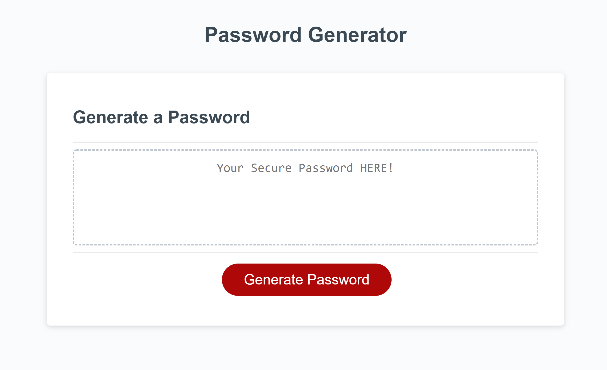

# Password Generator Starter Code

## Description
Generate a random strong password between 8 and 128 characters long. Uses window.confirm to ask user with options for their password. Outputs to textarea.

### Links
Deployed at
https://robyng.github.io/pass-gen/

Repo at 
https://github.com/robyng/pass-gen 

### Preview
